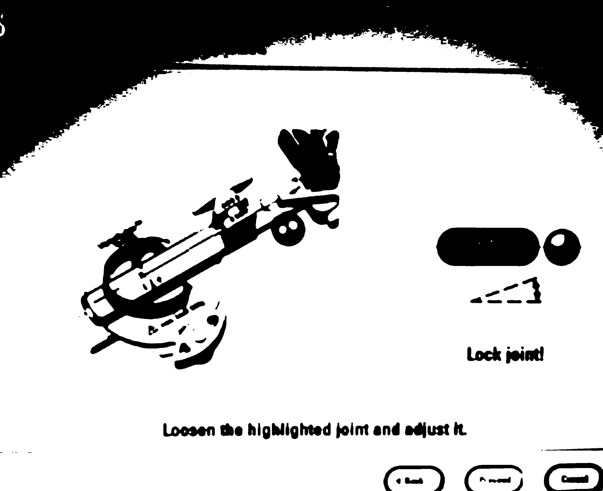
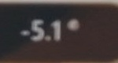

# Optimizacion-del-reconocimiento-de-variables-de-Varioguide
Este es un trabajo de Graduación por Santiago Galicia para optar al titulo de Licenciatura en Ingenieria Mecatrónica.
Este trabajo tiene como objetivo realizar una optimización del sistema de reconocimiento de variables previamente trabajado en la Universidad del Valle de Guatemala. Este sistema lee las variables de una pantalla de calibracion de instrumentos de neurocirugia utilizando el software de [Varioguide](https://www.brainlab.com/es/productos-de-cirugia/relacion-de-productos-de-neurocirugia/navegacion-craneal/). 
El proposito principal de la optimización es disminuir el tiempo de las neuro-cirujias del Centro de Epilepsia y Neurocirugía Funcional HUMANA y en futuras iteraciones generar las operaciones en un proceso de automatizacion de la neurocirujia con un brazo motorizado.

En este espacio de GITHUB se trabajan distintas carpetas las cuales estan descritas en la siguiente lista:

1. Prototipos: aqui se trabajan los archivos de prototipos, ya sea de programacion como de archivos CAD 
2. Resultados: Aqui se almacenan los resultados obtenidos de los prototipos
3. Antecedentes: Aqui se almacenan los archivos pasados del sistema OCR
4. Documentacion: Aqui se almacenan los archivos utilizados para estudiar el sistema
5. Trabajo escrito: Aqui se encontrará la ultima version del trabajo de graduación

para poder utilizar los archivos que se describen en este repositorio se necesita la instalación de los siguientes archivos/programas>
1. Python
	* [tensorflow](https://www.tensorflow.org/install/pip).
	* [Tesseract](https://pypi.org/project/pytesseract/).
	* [scipy](https://scipy.org/install/).
	* [numpy](https://numpy.org/install/).
	* [pandas](https://pypi.org/project/pandas/).
	* [matplotlib](https://matplotlib.org/stable/users/installing/index.html).
	* [OpenCV](https://pypi.org/project/opencv-python/).
	* [Pillow](https://pypi.org/project/Pillow/).
	* [TkInter](https://www.tutorialspoint.com/how-to-install-tkinter-in-python).
2. Tesseract
	* [Tesseract](https://github.com/tesseract-ocr/tesseract).
3. CUDA(Opcional):  Este modulo es opcional dado que puede meorar el rendimiento de los algoritmos de machine learning si se tiene el suficiente poder computacional para implementarlos (24GB+)
	* [CUDA](https://developer.nvidia.com/cuda-downloads).
4. [Arduino](https://docs.arduino.cc/software/ide-v1/tutorials/Windows)
	* [ESP32 Library](https://randomnerdtutorials.com/installing-the-esp32-board-in-arduino-ide-windows-instructions/).
	* [ArduinoJSON Library](https://arduinojson.org/).

## Algoritmo OCR
Este algoritmo de reconocimiento de caracteres por medio de vision de computadora pretende reconocer los angulos de ajuste desplegados por el sistema de Varioguide en la pantalla del laboratorio de HUMANA Guatemala y de esta manera automatizar el proceso quirurjico de un neurocirujano.
El sistema de visión por computador cuenta con el comportamiento de forma secuencial. Este algoritmo utiliza la librería de Tesseract para realizar el procedimiento de recolección de caracteres y reconocer que junta es la manejada. Asi mismo el algoritmo procesa las imagenes para de ultimo reconocer una red neuronal que reconozca no tan solo el angulo sino el desplazamiento necesario. 
En las siguientes imagenes se puede observar el desarrollo del procesamiento de imagenes.
### Captura original

### Procesamiento

### Recortada

### digito recortado y procesado

## Sistema de soporte de camara Web
Este sistema de soporte de pantalla fue desarrollado utilizando la herramienta de Autodesk Inventor Professional 2023 y en desarrollo cad se determino de la siguiente manera:

Se utilizo material PLA para la impresion 3d y corte laser con planchas de MDF.

