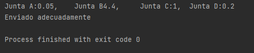

# Resultados
En esta carpeta se almacenan fotografías de los resultados de los prototipos asi como tambien del trabajo final
En esta carpeta se almacenan las imagenes y capturas de los resultados de los prototipos como tambien se contienen las fotografías del resultado del trabajo final.
En la carpeta de [Google Drive](https://drive.google.com/drive/folders/1RPtuFDLAzQxeFY3Tzz4o4T5q7xQjW3tY?usp=sharing) se encuentran archivos multimedia en los cuales se pueden visualizar tanto 3 videos de funcionalidad.
Abajo se muestran ejemplos de los resultados obtenidos.
### Modelo calificador:

### Mecanismo de soporte de webcam:

### Prueba de envio serial:

